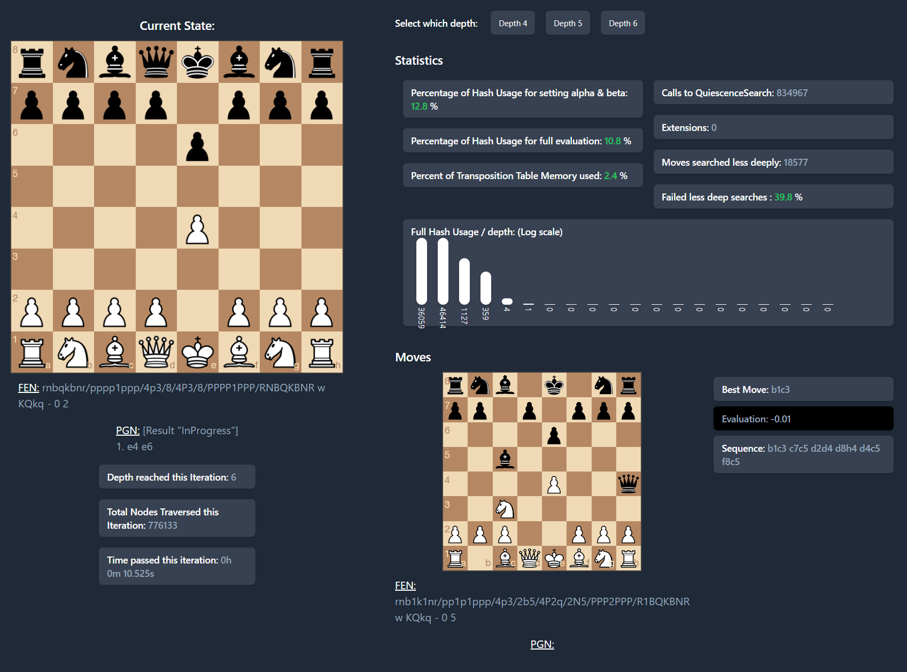
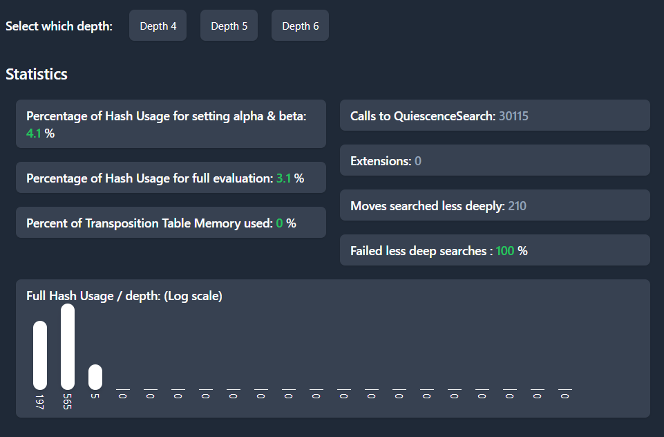
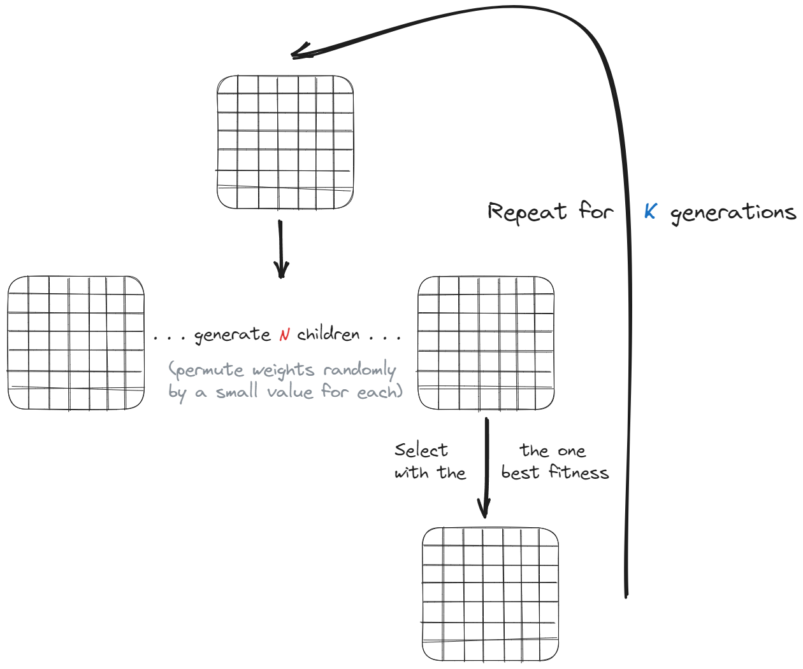

<p align="center">
	
</p>

# Chess Challenge

This is my entry for Sebastian Lague's [competition](https://www.youtube.com/watch?v=iScy18pVR58) that imposes an arbitrary limit on the length of your engines code. To be exact every participant has a maximum of 1024 tokens at his disposal to craft the best chess bot they can. Sounds like a lot, or extremely little depending of your conception of tokens. In this case a token is the smallest unit the compiler can see, with some exceptions. Therefore your 28 character Java like variable `ChessEngineBotThinkingBoardGamePiecePlayerMoverFactory` will only count as a single token, while `{` also counts as one. You also cannot load external files or use certain functions to extract variable names, which is enforced by limiting the allowed namespaces.

I wanted to submit a bot which uses an innovative technique to try and win the competition (not by creating the best bot but rather by creating the most innovative bot). To that end I started by implementing a basic chess bot, using all the tried and tested techniques (Minimax, quiescence search, search extensions and transposition tables).

This did sadly not work out, but I learned a lot along the way.

In this article:
 - [Implementing and debugging a chess engine](#Building-a-chess-computer)
 - [Trying to innovate and failing (using a Genetic Algorithm)](#Fine-tuning-the-evaluation-using-a-Genetic-Algorithm)
 - [Trying again and failing again (using statistics)](#Using-Statistics-to-create-a-perfect-evaluation-function)

## Building a chess computer

The first step was to actually write a functional, if not decent, chess computer.

### Minimax

The basic algorithm most chess computers use to evaluate moves and play the game is [Minimax](https://en.wikipedia.org/wiki/Minimax) (an alternative would be MCTS - Monte Carlo Tree Search). Luckily the actual engine (chess implementation) had already been created by Sebastian Lague for the competition, which meant that we could focus only on building the bot.

Minimax is very simple to understand and to explain at its core. There is only one really necessary component, which is an evaluation function that can compute a score (positive if white is winning and negative if black is winning) from a position that serves as a proxy for the chance of winning the game. White is therefore trying to play in way that maximises the score, black in a way that minimises the score. 

The computer generates all possible moves, and then all possible moves for each of those moves, up to the desired depth. At the lowest level, it applies the evaluation function to get a score for each of the final positions. Assuming white started and the depth was set to 4 (so the move on the lowest level was made by black) it would find the move that resulted in the position with the lowest score (minimizing for black). On level 3 it would then choose the move that resulted in the highest score (maximising for white) and so on.


This algorithm ensures that the move chosen is the most balanced move, by always making the opponent take the best move possible. It therefore always assumes that the opponent is at least as good as itself. This also means that certain traps that might work on beginners in chess are not moves that would be considered by the computer, as it would simulate an opponent smart enough to see the trap.

If you have correctly understood the way the algorithm works, you know that there are two main constraints that would limit a chess computer built on top of it. One is obviously the accuracy of the score returned by it's evaluation function. A bot is always only as good as the evaluations it produces.
The other is the number of nodes (which simply are moves in this context), it can evaluate in a given time. The deeper the bot observes the game tree, the better the move will be.

Improvements to the evaluation function are easier to do than to optimize the speed, since there is an absolute hard limit on the maximum number of nodes that will be traversed. In addition to that, because the implementation of the game itself is not under our control, we cannot optimise this main contributor to the computation time (Also Sebastian Lague has already highly optimised this code).

### Building a tool to debug the bot

So, to improve the evaluation function we need to get an insight into the world the bot sees, and most importantly the way the score impacts the selection of the best moves on the lower levels of the game tree (deeper into the search). Our brains are simply not capable of visualising the thousands and thousands of positions that the computer evaluates (To illustrate, even at depth 4, there are already more than 456976 different possible moves that have been played. This number grows very fast, since chess offers so many different possible moves). 

I created a very simple dashboard that would allow me to inspect the thought process of my bot live, while it was calculating the moves. 

It consists of a main view on the left, which shows the current gamestate and some basic information like depth, time passed and the global number of nodes traversed.
The FEN and PGN are clickable and link to the lichess analysis board, which allows for easy comparison with the stockfish evaluation.

<p  align="center">

</p>


It also shows more detailed usage stats, about the transposition table and usage of advanced search features, like quiescence search and extensions.

<p align="center">
	
</p>

On the bottom right there is another board, which allows us to inspect the bots thought process. It shows the move the bot chose (Best Move), the evaluation and the sequence of moves that were chosen by minimax (so the best move for white, then the best move for black...). This makes it possible to see why the bot chose a certain move as the best, and where the evaluation score is coming from.

This is especially valuable when debugging things like checkmates, where the bot might see a mate in 2, but go for the mate in 4 that is also possible, because of very subtle bugs.


<p align="center">
	
</p>

### Transposition tables

I mentioned there being analytics for transposition table usage, but what does this mean exactly?
An optimisation for the basic minimax algorithm is to implement a hash table that stores the evaluation (with the corresponding depth) with the board position being the index.

This allows the computer to use that evaluation, without having to recompute the entire depth, every time it sees this position, saving precious computation time.
You can see just how effective it is, by comparing the usage statistics for the depths 4, 5 and 6 on the opening position shown in the image above.

<p align="center">
	
</p>
<p align="center">
	
</p>
<p align="center">
	
</p>

You can see the `Percentage of Hash Usage` fields slowly going up with each passing iteration, because the transposition table gets populated with more and more evaluations.

The graph on the bottom shows the usage for each depth individually. The first bar (at depth 4) is always a bit lower than the one for depth 5, because it is able to make use of the positions at depth 5 from the last iteration.

### Quiescence Search and Search Extensions

I mentioned quiescence search and extensions in the last paragraph, but what are they exactly.

Quiescence search is a way to make evaluations more stable in the mid and endgame, where there might be successions of 3 or 4 moves that capture a piece. This skews the evaluation because our bot might stop searching at depth 4 because of time constraints, missing that our opponent was just about to take our queen, because we put it in peril by capturing a rook.

Quiescence search mitigates this problem by continuing the search even after the time ran out. However, it only searches captures, until there are none left. 
In a very complicated midgame position, both players having positioned their pieces and ready to capture the center, this guarantees that the bot does not miss the opponent or itself capturing a valuable piece, just because the search depth was not deep enough.

An example would be this [game](https://lichess.org/analysis/pgn/1.%20e4%20e5%202.%20Nf3%20Nc6%203.%20d4%20Qh4%204.%20g3), you could try playing taking with the queen until there is no possible capture left. If you simply stop after 4 moves, you might notice that there are significant threats on the board, that the evaluation function might not be able to account for.

You can see the quiescence search utilisations if you go back to the images comparing the transposition table usage above.


### Time Management and Early Exit

Another aspect of the bot that can be improved is the time management, which is critical, because it impacts the use of the most critical resource our computer has, computation time. Is it better to spend more time at the beginning for a stronger opening, should we conserve time for the midgame or is searching very deep to find early checkmates in the endgame the most valuable?

The matter is complicated by the fact that the time required for computing each depth changes over the course of a game, from a few seconds at the very beginning to milliseconds in the end, when only a few pieces are left.

To somewhat objectively choose the best way to manage time, I created a visualisation that would show me how my algorithms performed in a real game. Comparing the different types of time management for real games would be better, but way more time consuming to test.

This is a more explicit version of the algorithm I use to allocate thinking time:
```c++
// Calculate thinking time: totalTime * endGameReserve / avgMovesUntilEndgameStarts + increment
piecesLeft = board.GetAllPieceLists().Select(x => x.Count).Aggregate((x, y) => x + y)
if (piecesLeft > 20) {
	thinkingTime = ((int)(timer.GameStartTimeMilliseconds * 0.01) + timer.IncrementMilliseconds);
} else {
	thinkingTime = ((int)(timer.GameStartTimeMilliseconds * 0.05) + timer.IncrementMilliseconds);
}

// Emergency stop to prevent time outs if thinkingTime is bigger than the remaining time
if ((thinkingTime - timer.IncrementMilliseconds) * 2 > timer.MillisecondsRemaining) {
	thinkingTime = timer.MillisecondsRemaining / 4;
}
```

My simulation outputs a projected evolution of the time allocated to calculate the best move that looks like this:

<p align="center">
	
</p>

## Fine tuning the evaluation using a Genetic Algorithm

This limitation, you would assume, hampers the addition of complex evaluation functions and also prevents the implementation of any neural networks or similar structures necessary for chess engines of the second type described above. 

My first instinct therefore was to do something akin to knowledge distillation, inspired by the NNUE of Stockfish. It uses the current board as an input and by applying the weights and biases of the net it comes up with a number. If, instead of using a complex network, we used a single 64x64 grid of values for each type of piece, we could distill the game knowledge of powerful engines into a very small number of bytes. This evaluation function could then still be “plug and play” with a traditional Minimax engine.

<p align="center">
	
</p>

### The Idea

The idea is very simple at it’s core. We would assigne a value to every square of the board a piece could stand on, and do that for every type of piece. To evaluate a position, we would only need to add the value of the squares every piece stands on. 

For example, a pawn is worth more, the further it moves up the board and the closer it comes to becoming a queen. Therefore we would assigne higher values to the squares further up the board, up to nearly the value of a queen on the seventh rank.

<p align="center">
	
</p>

For the implementation, we would need to save the values of each square to an array. When evaluating, we get back a bitboard representing the different pieces on the board as an array, and use a bitwise and operation to multiply it and the “model” together (I will refer to a the boards with values for each square that the genetic algorithm outputs as a model from here on out). The result would be a board with only the values of the squares left, that have a piece currently standing on them. We would then take the sum of these values and get a single score back. 

<p align="center">
	
</p>

Taking the sum of the scores from the 6 different boards (6 piece types: pawn, knight, bishop, rook, queen, king) together for each player and substracting them gives us a value in the format of the classic stockfish evaluation: `-1.5` for example to represent black winning by a certain margin, `+7.8` to represent white having a very powerful advantage.

### Implementing the genetic algorithm and training

The question that remains is that of setting the value for each of the squares of the boards. Here, a tried and tested technique of machine learning seemed perfect: genetic algorithms. The issue with traditional techniques of training machines in this context is that there are no nodes and edges to tune the values of using back and forward propagation.

Genetic algorithms on the contrary don’t use these more sophisticated techniques, and just mutate the values of the boards randomly between generations, always selecting the best of the current generation. Our training would therefore look something like this: we instantiate the model with randomly selected numbers between some boundary. We then evaluate these “weights” to assign a fitness to each and at the end, we select the very best. We then slightly but still randomly mutate the values to create 500 or more children and assign a fitness to each again. 

<p align="center">
	
</p>

We repeat this for a few hundred generations and we would be left with a single model that has been optimized for the fitness function. 

Now we have the issue of defining an appropriate fitness function, to make sure we really chose the models that have the best chance of producing accurate evaluations. To do this I downloaded a large number of lichess and chess engine games from the internet in PGN format. PGN stands for “portable game notation” and it encodes chess games into a series of moves with a bit of metadata (`[%eval ...]` is of interest here).

```pgn
[Event "F/S Return Match"]
...
[White "Fischer, Robert J."]
[Black "Spassky, Boris V."]
[Result "1/2-1/2"]

1. e4 { [%eval 0.17] [%clk 0:00:30] } 1... c5 { [%eval 0.19] [%clk 0:00:30] } 
2. Nf3 { [%eval 0.25] [%clk 0:00:29] } 2... Nc6 { [%eval 0.33] [%clk 0:00:30] } 
[...]
13. b3 $4 { [%eval -4.14] [%clk 0:00:02] } 13... Nf4 $2 { [%eval -2.73] [%clk 0:00:21] } 0-1

```

I then extracted the evaluation for each position and stored these for training, resulting in a few hundredths of thousands of lines of chess positions. This seemingly random string is actually a [FEN](https://de.wikipedia.org/wiki/Forsyth-Edwards-Notation) string, which stores the position of each chess pieces, therefore encoding the board. Paired with the evaluation that a powerful chess engine assigned to it, this was the perfect data set to train my own engine.

```json
{
    "positions": [
        {
            "fen": "rnbqkbnr/pp1ppppp/8/2p5/4P3/8/PPPP1PPP/RNBQKBNR w KQkq - 0 2",
            "eval": 0.19
        }
	]
}
```

The fitness function would consist of evaluating a position with the values of the boards that the current child - generated using the genetic algorithm - has and taking the difference of that and the actual evaluation of the position. To get the best child in a generation we would then take the one with the lowest overall score, indicating that it was the best at estimating the actual evaluation.

<p align="center">
	
</p>

### Disappointing results

My enthusiasm for this idea quickly ebbed away very quickly once I realised how long training would take and also how bad the first dozen generations really were.

Plugging in the values of the best models produced very bad results.

<p align="center">
	
</p>

I had to either conclude that the idea was flawed fundamentally, or that my training was not long enough to actually produce promising results.

## Using Statistics to create a perfect evaluation function

### The Idea

At the same time I also realised the futility of my genetic algorithm, which just overcomplicated the problem further. The nature of my fitness function and the genetic algorithm was to get the median evaluation for each square for each time a piece stood on it. In other words, the optimal solution, or the model with the best possible fitness, has weights for each square that are the median of the evaluations the training boards had when there was a piece standing on that specific square, because the fitness function would then find the lowest total difference between the expected evaluation (specified for each position in the training data) of a board, and the one provided by the model.

To illustrate the idea, consider a training set consisting of a single data point, a single FEN string associated to a single evaluation.

<p align="center">
	
</p>

There is (although impossible in chess) a single white pawn standing on `a7` rank of the board. The evaluation is very high, at `+100.0` let’s say. To get the best fitness, the model would assign the value `+100.0` to the square `a7`.

If we were to add a second and third data point, one where that same position with a pawn standing on `7a` was evaluated at `+30.0`  and again at `-100.0`, to get the best fitness we would take the median of the three evaluations which results in a value of `30.0` for the square `a7` of the first board (representing the pawn values) of the model.

Why? Because when evaluating fitness we would first get the difference of the actual evaluation and our models evaluation for the first position, which would be `70.0` in this case, `0.0`for the second position and `130.0` for the third, for a total fitness of `200.0`. If we were to choose a different value for the square `a7`, for example `+10.0` - the median of the three evaluations - we would find that the total fitness is `220.0`.

### Implementing the statistical evaluation

Implementing this new algorithm was a matter of collecting the evaluations of every time there was a certain piece on a certain square and once there was enough data, calculating the median.

The following gifs show the evolution of the boards over time (in order: King, Queen, Rook, Bishop, Knight, Pawn):

<p align="center">
	
	
	
	
	
	
</p>

Once I plugged these values into the Minimax framework and ran the bot, I was once again met with disappointment.

### Disappointing results

There are two options left as to why this method of creating an evaluation function did not work. Either I did not have enough data, which skewed the weights of my model, or this method of distilling knowledge and extremely interdependant data onto 6 boards of 64 squares each simply lost too much context.

# Conclusion

Distilling the knowledge stored in the Stockfish [NNUE](https://tests.stockfishchess.org/nns) (which is the model that was used to create the evaluations my model was trained on), which is pretty small but still about 50MBs, into only 24576 values was too much. The loss of context that my implementation produced was crippling it’s ability, because the different boards for each piece that make up the model do not consider the position relative to other pieces. Moving the queen to c6 would be evaluated as equally good, whether it blundered the queen to a pawn or delivered a beautiful checkmate.

There might be a smart way to compress more information into the boards (or "model inputs"), but that would require more code and also more model weights. And since the goal was to fit this into 1024 tokens of `C#` I had to be content with giving up.